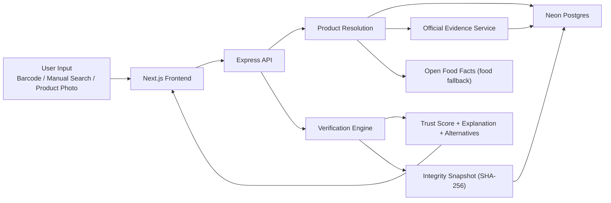

# GreenProof

GreenProof is an explainable greenwashing-detection platform for consumer products. It lets a user scan a barcode, search manually, or upload a packaged-product photo, then checks product claims against certifications, official evidence, brand context, and scoring rules to return a trust score with a clear explanation instead of a black-box verdict.

## Live

- Frontend: [greenproof-web-live.vercel.app](https://greenproof-web-live.vercel.app)
- Backend: [greenproof-api.vercel.app](https://greenproof-api.vercel.app)

## Why GreenProof Exists

Consumers see words like `natural`, `organic`, `eco-friendly`, and `sustainable` everywhere, but most people do not have time to verify whether those claims are specific, certification-backed, or just marketing language. GreenProof turns that verification process into a product flow:

- resolve the product
- inspect claims
- compare them with product-level and brand-level evidence
- score the result
- explain the decision
- preserve report integrity with a SHA-256 fingerprint

## What It Does

- Scans barcodes with live camera input
- Supports manual search by product name
- Supports barcode-photo upload and packaged-product OCR fallback
- Distinguishes product-level proof from weaker brand-level proof
- Extracts certifiable, vague, and suspicious claims
- Generates explainable trust scores with penalties and bonuses
- Shows issues found, positive indicators, and better alternatives
- Stores report fingerprints for tamper-evident integrity verification
- Uses a cloud Postgres database in production
- Runs a background official-evidence sync on Vercel Cron

## Production Architecture



## How It Works

### 1. Input acquisition

GreenProof accepts three practical entry points:

- `barcode scan`
- `manual search`
- `packaged-product photo`

Photo input is intentionally barcode-first. If barcode extraction fails, the frontend uses OCR text fallback for packaged products. This is helpful for bottles, labels, and cartons, but it is not meant to be strong clothing-image recognition.

### 2. Product resolution

The backend resolves the product in this order:

1. local database hit
2. official-evidence discovery import
3. Open Food Facts fallback for food/barcode cases

If a product is discovered through official evidence or Open Food Facts, GreenProof can save that product back into the database so future lookups are faster.

### 3. Evidence lookup strategy

GreenProof uses a **DB-first, category-wise hybrid** lookup model.

- If strong fresh evidence is already in the database, it returns quickly from cache.
- If evidence is missing or stale, the backend infers the sector and checks only a small request-time subset of relevant sources.
- A broader background sync keeps official evidence refreshed without making every user request slow.

This avoids the production problem of trying to scrape all sources on every scan.

### 4. Scoring

The verification engine:

- extracts claims from product text
- rewards product-level certification support
- applies weaker support for brand-level evidence
- penalizes vague or unsupported eco-language
- checks contradictions and low-confidence eco-signals
- produces an explainable score breakdown

### 5. Integrity verification

Every generated report is normalized and hashed with SHA-256. That fingerprint is stored in the database and can later be re-verified to detect tampering.

This gives:

- tamper-evident report verification
- stored report replay checks
- stronger trust when presenting results

This does **not** give:

- digital signatures
- immutable storage
- proof of authorship by itself

## Certification Coverage

GreenProof maintains an official/public certification source registry across:

- `cosmetics`
- `fashion`
- `household`

Current registry size:

- `23` certification sources
- `68` seeded products
- `48` brands
- `25` certifications
- `66` official evidence rows

Examples of represented source families:

- `MADE SAFE`
- `Leaping Bunny`
- `USDA Organic`
- `COSMOS / Ecocert`
- `EWG Verified`
- `Green Seal`
- `EPA Safer Choice`
- `ECOLOGO`
- `GOTS`
- `OEKO-TEX`
- `Fair Trade Textile`
- `GRS`
- `B Corp`
- `bluesign`
- `Better Cotton`
- `NSF`
- `PETA Cruelty-Free`
- `Vegan Society`
- `Carbon Trust`

### Runtime strategy

Not every source is hit on every request.

GreenProof uses:

- `request-time top sources per category`
- `background sync for broader evidence refresh`

That is the production-safe compromise between coverage and latency.

## Current Production Status

GreenProof is deployed and running with:

- Vercel frontend
- Vercel backend
- Neon Postgres
- secure sync endpoint
- daily Vercel Cron background refresh

The current cron path is configured in [vercel.json](./vercel.json) and hits:

- `GET /api/sync-evidence`

The sync route is protected with `CRON_SECRET`.

## Tech Stack

### Frontend

- Next.js App Router
- React
- TypeScript
- Tailwind CSS
- Zustand
- `@zxing/library`
- `tesseract.js`
- Recharts
- Lucide React

### Backend

- Node.js
- Express
- TypeScript
- Prisma
- Zod

### Data and infrastructure

- Neon Postgres
- Vercel
- Vercel Cron Jobs
- Open Food Facts fallback for food lookups

## Repository Structure

- `frontend/` — Next.js frontend
- `frontend/src/app` — app routes and frontend API proxies
- `frontend/src/components` — UI components
- `frontend/src/lib` — frontend helpers, OCR, shared client types
- `src/api` — Express routes and API services
- `src/engine` — claims, scoring, explanations, alternatives
- `src/lib` — DB helpers, seed data, source registry
- `src/cli` — ingestion, sync, and coverage scripts
- `prisma/` — schema, provider helpers, seed logic
- `data/official-evidence-snapshots/` — snapshot-backed official evidence inputs
- `tests/` — backend regression and integration tests

## Local Development

### Backend

```bash
npm install
cp .env.example .env
```

### Choose a database mode

#### Fast local fallback: SQLite

```env
DATABASE_URL="file:./dev.db"
GREENPROOF_DB_PROVIDER="sqlite"
```

Then run:

```bash
npm run db:migrate
npm run db:seed
```

#### Postgres-first mode

Start local Postgres:

```bash
npm run db:postgres:start
```

Then run:

```bash
npm run db:postgres:push
npm run db:postgres:seed
```

### Start backend

```bash
npm run start:api
```

Backend runs on `http://localhost:4000`.

### Frontend

```bash
cd frontend
npm install
cp .env.example .env.local
npm run dev
```

Frontend runs on `http://localhost:3000`.

## Key Scripts

### Backend

```bash
npm run typecheck
npm run test:api
npm run test:engine
npm run test:ingestion
npm run test:integrity
npm run test:seed-data
```

### Database

```bash
npm run db:seed
npm run db:coverage
npm run db:postgres:start
npm run db:postgres:push
npm run db:postgres:seed
npm run db:postgres:coverage
```

### Evidence ingestion and sync

```bash
npm run fetch:evidence
npm run fetch:evidence:source
npm run fetch:evidence:missing
npm run ingest:all
npm run ingest:sector
npm run ingest:source
npm run sync:evidence
npm run sync:evidence:source
```

### Frontend

```bash
cd frontend
npm run typecheck
npm run build
```

## Main API Endpoints

- `POST /api/scan`
- `GET /api/product/:id`
- `GET /api/brand/:id/reputation`
- `GET /api/certifications`
- `GET /api/certification-sources`
- `GET /api/stats`
- `POST /api/feedback`
- `POST /api/verify-integrity`
- `GET /api/sync-evidence`

## Example Requests

### Search a product

```bash
curl -X POST http://localhost:4000/api/scan \
  -H "content-type: application/json" \
  -d "{\"query\":\"Mamaearth Vitamin C Face Wash\"}"
```

### Scan a barcode by value

```bash
curl -X POST http://localhost:4000/api/scan \
  -H "content-type: application/json" \
  -d "{\"barcode\":\"8901000000132\"}"
```

### Inspect certification sources

```bash
curl http://localhost:4000/api/certification-sources
```

### Trigger a protected sync

```bash
curl http://localhost:4000/api/sync-evidence?mode=source\&value=cosmetics-made-safe \
  -H "authorization: Bearer $CRON_SECRET"
```

## Recommended Demo Searches

- `Mamaearth Vitamin C Face Wash`
- `Mamaearth Onion Shampoo`
- `No Nasties Blanc Classic Tee`
- `The Better Home Dishwash Liquid`
- `ATTITUDE Window & Glass Cleaner`
- `Patanjali Kesh Kanti Natural Hair Cleanser`

## What GreenProof Does Well

- makes sustainability scoring explainable
- distinguishes proof-backed claims from vague marketing
- keeps results cloud-backed and laptop-independent
- supports real product discovery beyond a static demo list
- separates fast request-time lookup from heavier sync work

## Current Limitations

- scores reflect available evidence, not absolute truth
- normal product-photo understanding is still secondary to barcode/manual search
- OCR is stronger for packaged products than for apparel
- some source families still rely on snapshot-backed evidence rather than full structured live APIs
- background sync improves coverage over time, but not every unseen real-world product is guaranteed to resolve instantly

## Roadmap

- deepen official evidence rows per source
- improve unseen-product discovery breadth
- strengthen packaged-product OCR confidence handling
- expand product-photo understanding where it is actually useful
- continue improving source normalization and matching quality

## License

MIT
